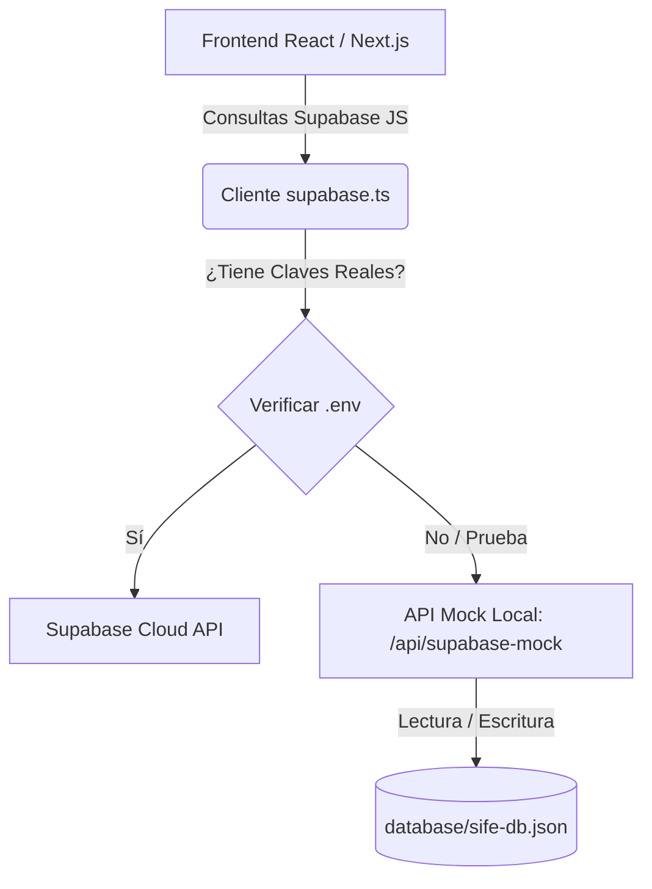

# Guía de Arquitectura de Base de Datos y Plan de Mocks (Padres)

Esta guía explica el funcionamiento de la **Base de Datos Local Híbrida** de SIFE, cómo se realiza la transición automática a **Supabase** y el diseño de la estructura de datos y mocks necesarios para la **Vista de Padres** (Responsables Económicos).

---

## 1. Arquitectura de Base de Datos Local Híbrida

Para darte la misma experiencia de desarrollo local que ofrece Laravel (con su archivo SQLite), hemos estructurado un sistema híbrido y transparente.



### La Carpeta `database/`
En la raíz de tu proyecto encontrarás:
* 📁 `database/`: Carpeta del motor de base de datos local.
* 📄 [database/sife-db.json](file:///d:/SIFE/database/sife-db.json): Archivo físico que actúa como tu base de datos SQLite local. Almacena en formato JSON todas las tablas de tu sistema (`leads`, `institutions`, `students`, `courses`, `payments`, etc.).

> [!NOTE]
> Puedes abrir `sife-db.json` en cualquier momento, ver los registros creados desde el navegador, editarlos a mano o borrarlos para reiniciar tu base de datos local.

### Transición Transparente a Supabase
El frontend de todas tus vistas (Alumnos, Cursos, Ajustes, etc.) utiliza la sintaxis estándar de Supabase:
```typescript
import { supabase } from "@/lib/supabase";

// Esta sintaxis NO cambia nunca
const { data } = await supabase.from('students').select('*');
```
* **En Desarrollo:** El archivo [supabase.ts](file:///d:/SIFE/src/lib/supabase.ts) redirige esta consulta a tu disco local.
* **En Producción:** Cuando actualices [.env](file:///d:/SIFE/.env) con tu clave y URL real de Supabase, las llamadas irán directamente a la base de datos PostgreSQL en la nube de Supabase.

---

## 2. Estructura de Datos para la Vista de Padres

La **Vista de Padres** (Responsables Económicos) requiere una estructura de base de datos que relacione a los tutores, los alumnos a su cargo, las cuotas/conceptos de cobro y los pagos realizados.

A continuación, se detalla el esquema relacional que se guardará en tu base de datos local (`sife-db.json`) y posteriormente en las tablas de Supabase:

### Tabla: `responsibles` (Responsables Económicos)
Almacena la información de los padres o tutores que pagan las cuentas.
```json
{
  "id": "resp_001",
  "full_name": "Carlos Ortega",
  "email": "carlos@colegio.edu.ar",
  "phone": "264-4123456",
  "dni": "28.345.678",
  "alias_assigned": "carlos.ortega.sife", // Alias único asignado para transferencias SIFE
  "cbu_assigned": "0000003100012345678901",
  "created_at": "2026-05-17T12:00:00Z"
}
```

### Tabla: `students` (Alumnos)
Cada alumno pertenece a una institución, un curso y tiene un responsable económico asignado.
```json
{
  "id": "stud_001",
  "first_name": "Matias",
  "last_name": "Ortega",
  "dni": "48.123.456",
  "course_id": "course_1o_A",
  "responsible_id": "resp_001", // Relación con el responsable económico
  "institution_id": "inst_001",
  "status": "active"
}
```

### Tabla: `payments` (Cuotas y Conceptos)
Registra las cuotas mensuales, talleres, excursiones, materiales u otros cobros asignados a un alumno o familia.
```json
{
  "id": "pay_001",
  "student_id": "stud_001",
  "concept_name": "Cuota Mensual - Mayo 2026",
  "amount": 65000,
  "due_date": "2026-05-10T23:59:59Z",
  "status": "pending", // pending, paid, expired, processing
  "category": "cuota", // cuota, taller, excursion, material, donacion
  "created_at": "2026-05-01T08:00:00Z"
}
```

### Tabla: `transactions` (Historial de Pagos y Conciliación)
Almacena el historial de comprobantes cargados por los padres y las validaciones del bot de conciliación automática.
```json
{
  "id": "tx_001",
  "responsible_id": "resp_001",
  "payment_ids": ["pay_001"],
  "amount": 65000,
  "payment_method": "transferencia", // transferencia, mercado_pago
  "receipt_url": "/receipts/tx_001.pdf", // Simulación del archivo del comprobante
  "status": "approved", // approved, pending_validation, rejected
  "validated_at": "2026-05-11T10:15:30Z",
  "created_at": "2026-05-11T10:10:00Z"
}
```

---

## 3. Plan de Mocks Sugeridos para la Vista de Padres

Para que puedas construir una interfaz visual impresionante (premium, responsiva y dinámica) para el portal de padres, debes cargar estos mocks iniciales en el sistema.

### Caso de Prueba: Familia Ortega
1. **Padre:** `carlos@colegio.edu.ar` (Contraseña: `password` - Modo Mock)
2. **Hijos a cargo:** 
   * **Matías Ortega** (1° Grado 'A' - Cuota Base: `$65.000`)
   * **Sofía Ortega** (Sala de 5 - Cuota Base: `$45.000`)
3. **Estado Financiero de la Cuenta Familiar:**
   * **Deuda Pendiente:** `$65.000` (Cuota de Mayo de Matías, vencida).
   * **Saldo a Favor (Crédito):** `$5.000` (Pago de más en el mes anterior).
   * **Talleres Extra programáticos:** Matías está inscripto en *Taller de Ajedrez* (`$8.000` mensual).
4. **Historial Reciente:**
   * **Aprobado:** Pago de la Cuota de Abril de Sofía (`$45.000`) - Conciliado automáticamente en 3 minutos.
   * **En Proceso:** Comprobante cargado hace 5 minutos por el Taller de Ajedrez (`$8.000`) en estado *Esperando Validación de Homebanking*.

---

## 4. Guía de Trabajo para el Portal de Padres

Cuando crees la vista del padre (por ejemplo, en `src/app/parent/dashboard/page.tsx` o similar), te recomendamos implementar las siguientes secciones visuales para impresionar al usuario:

1. **Header Familiar:**
   * Mostrar el CBU y Alias único asignado a la familia para que puedan transferir directamente sin cargar comprobantes (Conciliación Pasiva).
2. **Resumen de Cuentas (Tarjetas con Micro-animaciones):**
   * Tarjeta Roja: Deuda total a pagar.
   * Tarjeta Verde: Saldo a favor/créditos.
   * Tarjeta Azul: Próximo vencimiento más cercano.
3. **Lista de Hijos (Tabs o Acordeón):**
   * Mostrar el estado académico y financiero de cada hijo por separado.
4. **Carga de Comprobantes Inteligente:**
   * Un área de drag-and-drop premium donde el padre sube el comprobante de transferencia si pagó de forma tradicional, simulando el inicio del bot de validación automática con una barra de carga dinámica.

> [!TIP]
> Mantén la paleta de colores coherente con SIFE (azules premium `blue-600`, fondos limpios `slate-50` y tipografía nítida `Inter`). Puedes guiarte por las clases del panel de administración para mantener la consistencia estética.
